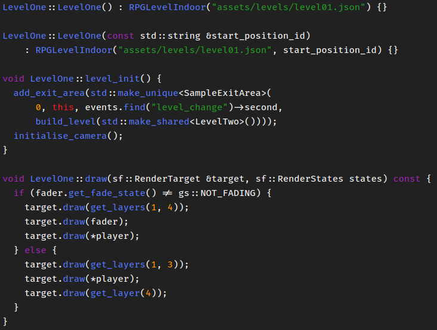

## GS2D Framework

**A lightweight easy to learn, use and extend open-source framework for 2D games
over the C++ programming language**. That's the main goal of the GS2D Framework.
It hopes to provide pratical (yet simple) usage of Object-Oriented Programming
for a game that can be built with any text editor.

**Code simplicity and readability** are two of its objects, being able to
express the demo in the GIF with only about 299 lines of code
(which 97 are for headers).

**It uses [SFML](https://www.sfml-dev.org) and supports
[Tiled](https://www.mapeditor.org/) orthogonal maps!** For Tiled, you just
need to export (save) everything it creates (tilesets and tilemaps) in JSON
and GS2D can understand it into a visual and collidable level.

#### Requires

- [GCC](http://gcc.gnu.org) (7 or later).

-  [SFML](https://www.sfml-dev.org).

-  [JSON For Modern C++](https://github.com/nlohmann/json) (already embed within
  the project's structure).

#### How to install

You can see the
[installation](https://github.com/murilobnt/gs2d/blob/master/.github/installation/installation.md)
page of this repository for information about it.

#### Project details

- [Wiki](https://github.com/murilobnt/gs2d/wiki).

-  [Code comparison](https://github.com/murilobnt/gs2d/blob/master/.github/comparison.md)
of different implementations of a simple game scenario.

#### License

GS2D is licensed under the [MIT License](https://github.com/murilobnt/gs2d/blob/master/LICENSE).

